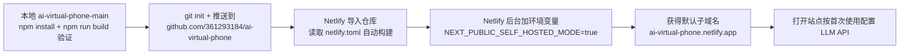

I have all the context I need. Let me create the plan for deploying the ai-virtual-phone project.

The task involves deploying the local `ai-virtual-phone-main` directory to Netlify via the user's own GitHub account `361293184`. This is a deployment task, not a UI design task, so no `<design>` section needed. Let me create the plan.

<plan_result>
<req>
## 需求概述
将本地下载的 `c:/Users/YG/Desktop/ai-virtual-phone-main`（Next.js 15 独立聊天 App，源自仓库 `xiaolongbao0709/ai-virtual-phone`）部署到线上，生成一个新链接供用户使用。

## 核心功能与步骤
- 在本地完成项目构建验证（npm install + npm run build），确保部署时平台构建能一次通过。
- 将本地目录初始化为 git 仓库并推送到用户自己的 GitHub 账号 `361293184` 下的新仓库。
- 在 Netlify 上导入该仓库并完成部署（使用平台默认子域名，配合项目自带的 netlify.toml）。
- 在 Netlify 后台配置必需环境变量 `NEXT_PUBLIC_SELF_HOSTED_MODE=true`（平台不读取仓库内的 .env.example）。

## 边界与说明
- `xiaolongbao0709` 不是用户的账号，代码最终归属用户自己的账号 `361293184`。
- 不改动 SullyOS 工作区（`c:/Users/YG/Desktop/SullyOS-master`）的任何 git 配置/远端，这是独立项目。
- 无法直接访问用户 Netlify 账号，云端导入与环境变量配置需指导用户在 Netlify 后台操作。
</req>

<tech>
## 技术栈
- 框架：Next.js 15 + React 19 + TypeScript，Node v22.14.0 环境。
- 构建：npm（项目带 package-lock.json），build 脚本含多个预处理步骤（weixin-assistant-dist、personal-push-dist、restore-backdrop-filter）。
- 部署：Netlify，自动读取项目自带 netlify.toml（command=npm run build，publish=.next，plugin @netlify/plugin-nextjs）。
- 源码托管：GitHub，用户账号 `361293184`。

## 实施方式
### 总体策略
采用「本地验证 → 推送 GitHub → Netlify 导入」的标准链路：
1. 先在本地 `npm install` + `npm run build`，确认构建通过（next.config.mjs 已 `ignoreBuildErrors`，build 可跳过历史 TS 错误）。
2. 本地目录初始化 git 仓库，推送到 `github.com/361293184/ai-virtual-phone.git`（HTTPS，复用用户既有的 https 代理/直连经验）。
3. Netlify 导入该仓库，按 netlify.toml 自动构建，平台后台加环境变量 `NEXT_PUBLIC_SELF_HOSTED_MODE=true`，获得默认子域名。

### 关键决策与权衡
- **推 GitHub 而非手动上传**：Netlify 对 Next.js 需构建服务，推仓库导入最可靠，且后续代码更新可自动触发部署。
- **用 npm 而非 pnpm**：项目带 package-lock.json 且 netlify.toml 的 build 命令是 npm run build，保持一致性避免依赖差异。
- **分支用 main**：本地是 main 内容（正常设备版），初始化仓库时以 main 为默认分支，符合 README 的部署说明。
- **git 代理策略**：推送如遇代理失效，用 `git -c http.proxy= -c https.proxy=` 绕过直连（用户此前成功过）。

### 实施注意（执行细节）
- 构建耗时较长（含 3D 模型、中文字体等资源），耐心等待；若某预处理脚本因本地缺依赖失败，记录错误并尝试跳过对应脚本单独跑 `next build` 验证核心。
- 推送前确认远端地址正确：`git@github.com`（SSH）易因认证失败，改用 HTTPS `https://github.com/361293184/ai-virtual-phone.git`，并确认远端是用户自己的账号而非 xiaolongbao0709。
- 初始化时添加 `.gitignore`（项目应自带），避免把 node_modules/.next/本地密钥推上去；确认 `.env.local` 不在提交范围。
- 全程不动 SullyOS 工作区 git 配置，也不在其目录下执行 git 命令。

## 架构设计
部署链路组件关系：



## 目录结构（涉及文件）
```
c:/Users/YG/Desktop/ai-virtual-phone-main/   # [已存在] 部署目标项目，含全部源码
├── netlify.toml         # [已存在] Netlify 配置（build 命令 + publish + plugin + 缓存头）
├── package.json         # [已存在] build/dev/start 脚本，npm 依赖清单
├── package-lock.json    # [已存在] 锁定依赖，npm install 依据
├── next.config.mjs      # [已存在] Next 配置（ignoreBuildErrors、webpack fallback）
└── .env.example         # [已存在] 环境变量样例，部署需手动拷贝关键项到平台后台
```
说明：本项目为部署任务，不新增/修改源码文件；本计划不触碰 `c:/Users/YG/Desktop/SullyOS-master` 工作区。

## 环境变量（部署必配）
平台后台需添加（Netlify 不读取仓库 .env.example）：
```
NEXT_PUBLIC_SELF_HOSTED_MODE=true   # 必须，单机模式，跳过账号/激活码门禁
```
其余变量全可选，不填对应功能自动隐藏/停用，用户可按需在应用内自行配置。
</tech>

<extensions>
## Agent Extensions
- **code-explorer**
  - Purpose: 在制定计划前已用于定位项目结构（package.json、netlify.toml、next.config.mjs、README）。执行阶段如构建报错需定位具体脚本/依赖时复用，确认 ai-virtual-phone-main 是否含 .gitignore/.env.local 等文件，确保推送内容干净。
  - Expected outcome: 明确项目配置文件与待推送文件清单，避免把敏感/多余文件推上 GitHub。
</extensions>

<todolist>
<item id="build-verify" deps="">在 ai-virtual-phone-main 本地执行 npm install 并 npm run build 验证构建通过，记录结果与耗时</item>
<item id="init-repo" deps="build-verify">检查项目 .gitignore 与 .env.local，将目录初始化为 git 仓库并提交源码到 main 分支</item>
<item id="push-github" deps="init-repo">添加远端 github.com/361293184/ai-virtual-phone.git（HTTPS）并推送 main，失败时用 -c http.proxy= 绕过代理重试</item>
<item id="netlify-deploy" deps="push-github">指导用户在 Netlify 导入 361293184/ai-virtual-phone 仓库，按 netlify.toml 自动构建并发布默认子域名</item>
<item id="env-config" deps="netlify-deploy">指导用户在 Netlify 后台添加环境变量 NEXT_PUBLIC_SELF_HOSTED_MODE=true 并触发重新部署</item>
<item id="verify-launch" deps="env-config">打开部署后的子域名验证可访问，指导用户按首次使用配置 LLM API 开聊</item>
</todolist>
</plan_result>
