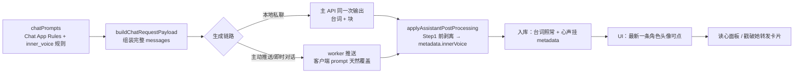

## 产品概述
给 SullyOS 聊天增加「角色心声」：角色每条回复都随台词同一次输出一段隐藏的内心独白，入库时解析剥离、存到消息字段，不进入渲染与上下文历史。用户点**当前对话最新一条角色消息的头像**，弹出「仅你可见」的极简读心面板；底栏「戳破她」把这段心声做成转发卡片发进聊天给角色看（不自动触发回复、不注入称谓、不安排反应，角色如何面对由她按人设自然展开）。

## 核心特性
- 心声随主 API 同一次生成（台词 + `<inner_voice>` 块一次输出，零额外调用），每次回复稳定产出（区别于看情况触发的思维链）
- 心声必须贴合角色性格与真实记忆（人设 + 记忆宫殿召回 + 共同回忆），严禁编造共同经历、严禁空泛模板，沿用全局反幻觉约束
- 覆盖全部生成链路：本地私聊 + worker 主动推送/即时对话（prompt 全在客户端组装，一处注入即全覆盖，worker 零改动）
- 六类心事内容池：真心话 / 吐槽 / 小动作 / 预谋 / 回忆 / 关系；层数不限（安全阀 >12 层判异常丢弃），每层 ≤30 字、整块 ≤200 字，解析失败静默
- 入口：仅最新一条角色消息头像可点（旧消息、无心声、解析中均静默不可点）；弹窗 = 白底细线极简读心面板，纯心声不带台词引用，固定高度内部滚动
- 「戳破她」= 心声转发卡片发进聊天：插入一条带语义包装的用户消息（让模型明白这是角色心声被转回给她自己看），不触发 AI 回复
- 每角色设置面板「角色心声」开关（默认开）；旧「撤回心声」死代码不复活，其隐藏设置位改造为心声开关；v1 仅私聊生效；reroll 后新回复覆盖旧心声


## 技术栈
- React + TypeScript + Tailwind CSS（沿用现有项目栈，无新依赖）
- 存储：现有 IndexedDB（DB.saveMessage），心声挂 `Message.metadata.innerVoice`，零迁移
- 测试：沿用现有 vitest 单测模式（参照 utils/offlineParser.test.ts 一类容错解析器测试）

## 实施思路
以「主 API 同一次输出 + 统一落库点剥离」为核心：在 Chat App Rules 规则段末尾按角色开关注入 inner_voice 输出要求；在 `applyAssistantPostProcessing`（本地 fetch 与 instant push 唯一汇聚点）Step 1 之前插入一次剥离，台词继续走原 13 步管线，心声写入该轮最后一条落库 assistant 消息的 `metadata.innerVoice`。UI 层仅在 MessageItem 头像入口、Chat.tsx 弹窗与转发卡片三处改动。

### 关键技术决策
1. **开关从 char 直接读**：`buildSystemPromptParts` 第一参即 `char: CharacterProfile`，无需改 `promptOptions` 透传链（chatPrompts.ts L283-307）。
2. **心声存 metadata 而非 content**：types.ts Message 已有 `metadata?: any`（L4001），天然不进上下文、不进渲染、旧消息 undefined 即兼容。
3. **剥离绝不断管线**：剥离器整体 try/catch，任何异常/格式问题都静默降级为"无心声"，保证正常回复零影响；剥离后剩余文本才是入库台词。
4. **转发卡片必须带语义包装**：心声是角色第一人称文本，若以纯 user 消息进上下文，下游会误当"用户说的话"。在 content 序列化前缀加 `[转发·心声（角色名）]` 标记（对齐 chatPrompts L80-88 既有卡片序列化模式），消息本体带 `metadata.innerVoiceForwardCard` 供 MessageItem 渲染卡片。
5. **解析器独立成 utils 文件并单测**：覆盖正常多层 / 未闭合 / 纯文本降级单层 / 未知标签 / 空内容 / 超长截断 / >12 层丢弃七类 case，与主链路解耦。

## 实施注意
- 剥离点必须位于 `applyAssistantPostProcessing` L688 Step 1 `normalizeAiContent` 之前；先通过 code-explorer 定位该函数内部实际构造消息对象并 `saveMessage` 的位置，将 innerVoice 挂到该轮**最后一条** assistant 消息 metadata（保证它就是"最新一条"，与头像入口判定一致）。
- Prompt 注入参照 chatPrompts.ts L315-319 `proactivePhotoGuide` 的条件变量 + `${...}` 插入模式；规则要点：回复结束后另起一行输出块；六类标签集固定；每层第一人称 ≤30 字；只写性格内与真实记忆里存在的内心（含记忆宫殿/共同回忆），严禁编造共同经历、严禁与台词重复、严禁提及该机制；台词照常输出。
- MessageItem 头像 slot（L1618-1622）包一层可点容器：仅当该消息为角色消息、是最后一条、且带 innerVoice 时才可点；不得与长按菜单/消息选中/avatarDecoration 叠加层冲突（pointer-events 与 z-index 需小心）。
- 「戳破她」插入消息后不调用 triggerAI；何时让角色开口仍走常规交互（私聊点右上角）。
- 设置开关字段命名 `innerVoiceEnabled`（默认开），接入模式照抄 `recallOutputEnabled`（types.ts L3174-3179 + Chat.tsx L3744-3747 updateCharacter + ChatModals.tsx L607-608 隐藏块改造），避免引入新模式。
- 性能：剥离为正则一次扫描 O(n)，消息量级可忽略；不改历史消息、不迁移数据；blob/HTML/语音等非文本消息路径不受影响。

## 目录结构
```
SullyOS-master/
├── types.ts                          # [MODIFY] 新增 InnerVoiceLayer/InnerVoice 接口；CharacterProfile 加 innerVoiceEnabled?: boolean（默认开）
├── utils/innerVoice.ts               # [NEW] 心声解析剥离器：extractInnerVoice(raw) → { clean, innerVoice|null }，含容错/清洗/截断/>12层丢弃
├── utils/innerVoice.test.ts          # [NEW] 解析器单测：覆盖七类容错 case
├── utils/chatPrompts.ts              # [MODIFY] Chat App Rules 段末尾（L980 前）按 char.innerVoiceEnabled 注入 <inner_voice> 输出规则
├── utils/applyAssistantPostProcessing.ts # [MODIFY] 主入口 Step1 前插剥离步骤，把 innerVoice 挂到该轮最后一条 assistant 消息 metadata
├── apps/Chat.tsx                     # [MODIFY] 最新一条判定 prop 下发、头像点击状态、读心面板 + 「戳破她」转发卡片（复用现有 Modal 与 saveMessage 路径）
├── components/chat/MessageItem.tsx   # [MODIFY] 角色头像可点容器；对带 innerVoiceForwardCard metadata 的用户消息渲染转发卡片
├── components/chat/ChatModals.tsx    # [MODIFY] 把 L607-608 隐藏的「撤回心声」设置块改造为「角色心声」开关
```

## 架构关系


## 关键代码结构
```ts
// types.ts（Message L3989 附近）
interface InnerVoiceLayer {
  type: '真心话' | '吐槽' | '小动作' | '预谋' | '回忆' | '关系' | '心声'; // 心声=降级兜底
  text: string; // ≤30 字
}
interface InnerVoice {
  layers: InnerVoiceLayer[]; // 安全阀 >12 层判异常丢弃
  at: number;
}
// Message.metadata.innerVoice?: InnerVoice（metadata 已是 any，无需改 Message 顶层）

// utils/innerVoice.ts 核心导出（仅签名，实现含七类容错 case）
function extractInnerVoice(raw: string): { clean: string; innerVoice: InnerVoice | null };
```


## 设计概述
本项目为既有聊天应用的增量 UI，视觉延续用户偏好：不要 emoji、低饱和柔和、细线极简。新增三类界面：可点头像（仅最新一条，加极轻的呼吸暗示避免不可发现）、极简读心面板弹窗、「戳破她」转发卡片。

- 读心面板：居中白卡片，圆角大而克制，1px 浅灰细线分层；头部头像 + 角色名 · 心声 + 右上收起，副标题「仅你可见」灰字；每层一行 = 类型小字（灰、无【】）+ 斜体心声（深灰），层间细线分隔；列表区固定高度、层多内部滚动、弹窗总高恒定；底部单个「戳破她」浅黄胶囊按钮，点遮罩或收起关闭。
- 转发卡片：气泡内卡片形态，头部「转发 · 心声（角色名 · 时间）」小字，正文为分层心声（类型灰字 + 斜体正文），整体低饱和白底浅边，与现有 chat_forward 类卡片视觉一致。
- 头像入口：最新一条角色消息头像加极轻的环形柔光/呼吸动画暗示可点，旧头像无变化，零打扰。

## 页面构成
- 读心面板（聊天页内弹窗，全局居中）
- 转发卡片（作为普通消息气泡渲染于聊天流）
- 头像可点暗示（消息列表内联）

## Agent 扩展
### Skill
- **frontend-design**
  - Purpose：为读心面板与转发卡片提供视觉方向校验，避免落入模板化默认样式，产出低饱和细线极简的最终视觉
  - Expected outcome：面板与卡片样式符合用户审美（无 emoji、不过粉、柔和浅色），代码落地时可执行的样式决策
### SubAgent
- **code-explorer**
  - Purpose：定位 applyAssistantPostProcessing 内部 saveMessage 构造点、MessageItem 头像 slot 精确渲染结构与 chatPrompts 消息序列化前缀位置，确保改动命中真实行
  - Expected outcome：拿到精确文件路径 + 行号 + 上下文代码，减少返工
