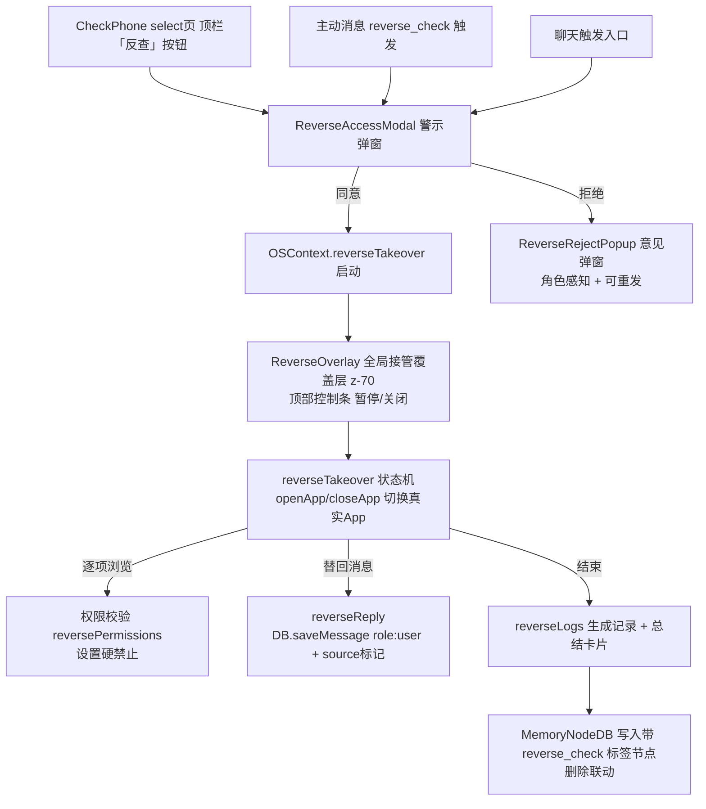

## 需求概述

在 SullyOS（React + TS + Vite 浏览器虚拟手机系统）中，按设计方案实现「反查手机」功能——「查手机」的反向：角色反过来接管并查看**用户的真实 SullyOS 界面**（真实界面自动操作，非模拟）。用户确认两点：
- **接管范围**：接管整个 SullyOS 系统（角色能切到真实桌面、打开任意 App 看真实数据）
- **开工方式**：按设计方案一步步全做、慢慢做（完整实现全部子功能）

## 核心功能

- **入口**：查手机 App（CheckPhone）→ 角色选择页顶栏右侧新增「反查」按钮
- **触发**：两种方式
  1. 角色主动发起（按角色性格的「反查倾向」参数驱动）
  2. 聊天中触发（角色提出"让我看看你手机"，出现可点击入口）
- **警示弹窗**：红色预警覆盖层 + 角色请求语（AI 生成）+ 同意/拒绝
- **拒绝后**：角色感知（聊天知道被拒）+ 意见弹窗（按性格，最多 3 条，可关闭）+ 可立即重发
- **接管真实界面**：角色接管整个 SullyOS（顶部控制条 + 暂停/关闭），程序化 openApp/closeApp 切换真实 App，自动浏览真实数据；设置 App 永远禁止
- **替回消息**：角色以用户身份（role:'user'）向目标对话发送消息，带 `source:'reverse_reply'` metadata 标记
- **反查权限系统**：App 列表动态读 INSTALLED_APPS，逐项开关，默认全开，设置永久禁止
- **反查记录**：记录谁/时间/查看了什么（含拒绝事件）
- **总结卡片**：接管结束自动生成角色感想卡片进私聊，基于真实查看内容防幻觉，可删除并联动删除记忆
- **角色记忆**：默认写入记忆宫殿（带「反查来源」标记），设置项可关

## 边界

- 现有「查手机」（select 角色 → 查看角色手机）流程完全不动，只加入口
- 设置 App 内部逻辑不动（只是"永远不可见"）
- 记忆系统实现不改，只调用其 API（MemoryNodeDB）


## 技术栈

- 现有架构：React 18 + TypeScript + Vite + pnpm，无需新增依赖
- 全部复用现有模块：`useOS()` 全局上下文、`PhoneShell` 全局覆盖层、`DB.saveMessage` 消息写入、`MemoryNodeDB` 记忆、`INSTALLED_APPS` 应用清单、`activeMsgClient` 主动消息

## 核心架构决策

### 1. 接管控制层放全局（OSContext + PhoneShell）
「接管整个 SullyOS」要求接管状态跨所有 App 存在。因此在 **OSContext 新增接管状态与方法**（`reverseTakeover` state + `startReverseTakeover/stopReverseTakeover/...`），在 **PhoneShell 加全局接管覆盖层组件**（类似 suspendedCall 的常驻层，z-index 用 z-[70] 高于现有 z-[60] 的 toasts），让角色接管后能切到任意真实 App。

### 2. 状态机驱动程序化导航
新增 `utils/checkPhone/reverseTakeover.ts`：AI 生成「查看意图」（按权限 + 角色自主顺序，如联系人→聊天→相册→朋友圈）→ 状态机按计划依次 `openApp(appId)` 打开真实 App，每项限时 + 总时长上限，用户随时可关。设置 App 硬禁止。暂停=停止自动操作队列交还手动；关闭=结束接管、生成记录+总结。

### 3. 替回消息复用现有写入链路
`utils/checkPhone/reverseReply.ts` 复用 `DB.saveMessage`（db.ts:795），写 `role:'user'`，metadata 带 `source:'reverse_reply'`，与真实用户行为区分（渲染/统计/上下文可识别）。

### 4. 记忆直接写入带标签节点（防幻觉）
`utils/checkPhone/reverseLogs.ts` 用 `MemoryNodeDB.save()` 直接写入带 `tags:['reverse_check']` 的记忆节点（内容是真实查看明细，不调 LLM 提取，保证不编造）。删除总结卡片时联动删除对应记忆节点。

### 5. 主动消息新增反查触发类型
扩展 `ActiveMsg2Mode` 联合类型（types.ts:324）新增 `'reverse_check'`，在 `activeMsgRuntime` 落地时识别该 subtype 弹出警示弹窗；「反查倾向」参数从角色性格标签推导（如包含查手机狂魔/傲娇/爱吃醋等标签 → 高频；内向/温和 → 低频）。

## 关键实现点（防冲突/防回归）

- **metadata 标记**：替回消息 source:'reverse_reply'；接管浏览记录 source:'reverse_check'——全局区分真实 vs 角色操作
- **接管中用户手动操作互斥**：自动操作队列与手动输入互斥，暂停才交还手动；恢复自动前不打断用户
- **设置硬禁止**：导航前逐 App 校验 reversePermissions；设置 App 任何情况不可查看
- **防刷屏**：接管中/警示中不重复弹；意见弹窗上限 3 条
- **总结防幻觉**：仅基于真实查看明细生成，不带入未查看内容
- **删除联动**：删总结卡片时弹「仅删卡片/卡片+记忆一起删」（默认推荐一起删）

## 架构图



## 目录结构

```
SullyOS-master/
├── types.ts                                      # [MODIFY] 新增反查类型（记录/权限/替回标记/接管状态）
├── constants.tsx                                 # [MODIFY] 新增「反查倾向」性格标签映射配置
├── context/OSContext.tsx                         # [MODIFY] 新增 reverseTakeover 全局状态 + 方法
├── components/PhoneShell.tsx                     # [MODIFY] 挂载全局 ReverseOverlay 接管覆盖层
├── components/checkPhone/
│   ├── ReverseAccessModal.tsx                    # [NEW] 红色预警警示弹窗（请求语+同意/拒绝）
│   ├── ReverseRejectPopup.tsx                    # [NEW] 拒绝后角色意见弹窗（最多3条，X关闭）
│   ├── ReverseOverlay.tsx                        # [NEW] 全局接管顶部控制条（正在查看+暂停/关闭）
│   └── ReversePanel.tsx                          # [NEW] 反查手机页（查看记录Tab + 权限设置Tab）
├── utils/checkPhone/
│   ├── reverseTakeover.ts                        # [NEW] 接管状态机（浏览计划、导航驱动、暂停/关闭）
│   ├── reversePermissions.ts                     # [NEW] 反查权限（App动态列表+开关+设置禁止）
│   ├── reverseLogs.ts                            # [NEW] 反查记录+总结卡片+记忆联动删除
│   └── reverseReply.ts                           # [NEW] 替回消息（生成+以用户身份写入+标记）
├── utils/activeMsgClient.ts                      # [MODIFY] 主动消息新增 reverse_check 触发类型
└── apps/CheckPhone.tsx                           # [MODIFY] select页加「反查」入口 + 接入面板
```

## 实施注意（执行细节）

- 大改动前先 `git commit` 备份点（commit message 以 `backup:` 开头），改动有 bug 可回退
- 记忆写入用 `MemoryNodeDB.save` 直接建带标签节点，绕过 LLM 提取管线，保证防幻觉与确定性
- 全局覆盖层加在 PhoneShell 现有覆盖层区段（StatusBar/Toasts 之后），z-index 用 z-[70] 高于 toasts 的 z-[60]
- 全程复用现有 `openApp`/`closeApp`/`DB.saveMessage`/`INSTALLED_APPS`，不重复造轮子
- 现有 CheckPhone 查手机流程、设置 App、记忆系统实现均不改动，只调用其 API


## Agent Extensions

- **code-explorer**
  - Purpose: 在实施前已用于定位 CheckPhone 状态机、OSContext 全局控制、PhoneShell 覆盖层、记忆宫殿 API、主动消息触发、消息写入等关键代码位置，为方案提供精确的行号级依据。实施过程中如需确认 CheckPhone 内部子界面结构、主动消息 metadata 透传细节，复用该 subagent 深入定位。
  - Expected outcome: 明确所有改动文件的精确位置与现有可复用 API，避免方案与实际代码脱节。
