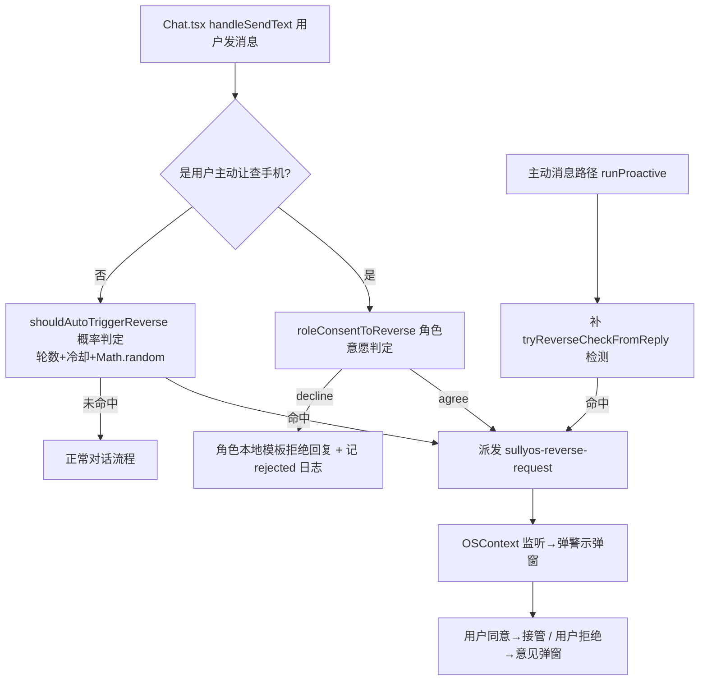

## 需求概述

在已完成的「反查手机」基础功能之上，增强触发机制。用户发现目前只有「角色在回复里开口说想看手机」才会触发，不够主动。用户澄清了三个增强点：

## 核心功能
1. **概率随机主动发起**：聊了若干轮后，按角色性格概率触发一次反查（爱查手机的角色更容易触发）
2. **用户主动让角色查**：用户说"你查我手机吧"这类话时，角色可自主同意或拒绝（不是直接放行）
3. **反查倾向自动推导**：从角色人设（systemPrompt 里的性格词：吃醋/粘人/多疑等）自动判断，无需单独配置

## 边界
- 不破坏现有「用户拒绝角色」逻辑，只新增「角色主动发起」和「角色拒绝用户」两条链路
- 角色拒绝用本地规则 + 本地文案模板，不额外调用 LLM（避免性能和费用开销）
- 需要反查冷却（localStorage 记录时间/轮次），避免频繁触发刷屏
- 补齐主动消息路径盲区（runProactive 不走 applyAssistantPostProcessing，需补检测）


## 技术栈
- 现有架构：React 18 + TypeScript + Vite + pnpm，无需新增依赖
- 复用已有：`resolveReverseProclivity` + `REVERSE_PROCLIVITY_TUNE`（constants.tsx:143-191，已就绪未使用）、`sullyos-reverse-request` 事件链路、OSContext 反查状态、`applyAssistantPostProcessing` 后处理

## 核心架构决策

### 1. 概率主动发起：新增独立工具模块 `utils/checkPhone/reverseTrigger.ts`
提供纯逻辑函数，集中管理反查触发的概率/冷却/倾向，避免散落在 Chat.tsx：
- `getReverseCooldown()` / `setReverseCooldown()`：localStorage 记录上次反查时间 + 触发轮次，防刷屏
- `rollReverseProclivity(char)`：调 `resolveReverseProclivity(char.systemPrompt)` → `REVERSE_PROCLIVITY_TUNE[level].weight` → 转成基础概率
- `shouldAutoTriggerReverse(char, roundCount)`：聊天轮数达到阈值 + 冷却期已过 + `Math.random() < probability` → 返回是否主动触发
- `roleConsentToReverse(char)`：角色对「用户让 TA 查手机」请求的自主意愿判定——基于倾向等级 + 随机，返回 `'agree' | 'decline'`
- 纯函数 + localStorage，可单测，不给 Chat.tsx 加耦合

### 2. 概率触发的钩子位置：`Chat.tsx handleSendText`
- 用户消息发送的唯一入口（apps/Chat.tsx:1116），在落库（1194 行）后、triggerAI（1337 行）前插入：
  - 统计对话轮数（用现有 activeCharacterId 的消息数或本地 counter）
  - 调 `shouldAutoTriggerReverse(char, roundCount)`，命中则派发 `sullyos-reverse-request` 事件（复用现有链路 → OSContext 弹警示）

### 3. 用户主动让角色查 + 角色可拒绝：`Chat.tsx handleSendText` 用户意图识别
- 新增用户意图正则 `REVERSE_USER_ASK_RE`（匹配"你查我手机吧/让你看看/你翻我手机/给你看"等）
- 命中后调 `roleConsentToReverse(char)`：
  - `'agree'` → 派发 `sullyos-reverse-request`（弹警示，用户确认后接管）
  - `'decline'` → 不弹警示，直接以角色身份回复一条拒绝语（本地模板按性格：低倾向"尊重你隐私，不看啦"；高倾向可能傲娇拒绝），并记一条 rejected 反查日志（reason: 'role_declined'）
- 复用 `DB.saveMessage` 写角色拒绝回复（role:'assistant'）

### 4. 补齐主动消息路径盲区
- 在 `runProactive`（OSContext:2208）落库后（约 2605 行）补一次 `tryReverseCheckFromReply(char, content)` 调用，让主动消息也能触发反查

### 5. 反查倾向复用
- 直接用已就绪的 `resolveReverseProclivity` + `REVERSE_PROCLIVITY_TUNE`，无需改 constants.tsx

## 架构图


## 目录结构
```
SullyOS-master/
├── utils/checkPhone/
│   ├── reverseTrigger.ts                 # [NEW] 反查触发纯逻辑：概率/冷却/角色意愿判定/拒绝模板
│   └── reverseTrigger.test.ts            # [NEW] 单元测试（概率边界、冷却、角色意愿、拒绝语）
├── apps/Chat.tsx                         # [MODIFY] handleSendText 插概率触发 + 用户意图识别 + 角色拒绝回复
├── context/OSContext.tsx                 # [MODIFY] runProactive 落库后补 tryReverseCheckFromReply 调用
├── utils/applyAssistantPostProcessing.ts # [MODIFY] 复用 tryReverseCheckFromReply（已有），可导出供 OSContext 用
└── utils/checkPhone/reverseLogs.ts       # [MODIFY] 若需要，补充拒绝日志 reason 字段
```

## 实施注意（执行细节）
- 概率权重映射：`weight 3/2/1/0 → 触发概率`，如 high≈0.20、medium≈0.12、low≈0.05、none≈0；轮数阈值 ≥3 轮
- 冷却：localStorage key `sullyos_reverse_cooldown`，记录 timestamp + 触发轮次，冷却 20 分钟 + 每次触发后轮次重置
- 角色拒绝语按性格模板：倾向 low/none 用「尊重你隐私，就不看啦」；high/medium 若触发拒绝则傲娇文案
- 拒绝时记 `appendReverseLog({ result:'rejected', rejectReason:'role_declined' })`，防刷屏由冷却控制
- 大改动前先 git commit 备份点（commit message 以 backup: 开头）
- 全部改动不破坏现有手动触发（CheckPhone 入口）与"用户拒绝角色"逻辑


## Agent Extensions
- **code-explorer**
  - Purpose: 在方案规划阶段已用于定位 Chat.tsx handleSendText、proactiveChat 定时器、runProactive、applyAssistantPostProcessing 等关键代码位置，为概率触发钩子和主动消息盲区补齐提供了行号级依据。实施过程中如需确认 Chat.tsx 用户消息落库细节、runProactive 落库末尾位置、或 applyAssistantPostProcessing 的 ctx 结构，复用该 subagent 深入定位。
  - Expected outcome: 精确锁定所有改动文件的插入位置，确保概率触发、用户意图识别、角色拒绝回复、主动消息盲区补齐能与现有代码无缝衔接。
