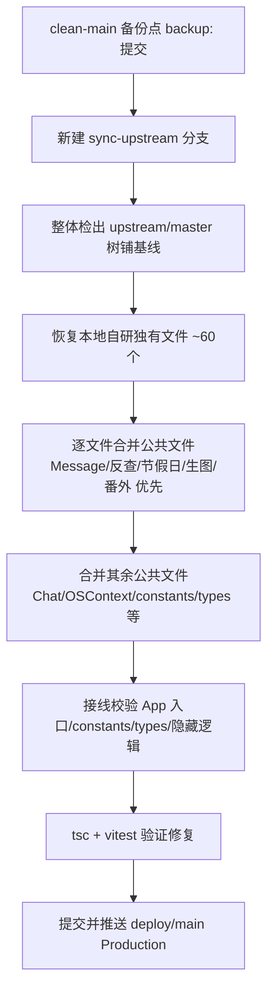

## 产品概述
将 SullyOS 项目与原作者仓库（https://github.com/qegj567-cloud/SullyOS）的 upstream/master 分支做全面同步。用户上次同步在 8.10，本次要同步自那时起上游的全部新内容，同时**完整保留用户自己开发的所有功能**（反查手机、Message 会话列表改造、中国节假日、生图、CSY、番外生成、小说共读、游戏、健康、离线模式、位置地图等）。

## 核心功能与边界
- 同步源：upstream/master（上游最新主线，已含 dev 全部提交）
- 引入上游新增功能：协作文档(features/collaboration)、七夕活动(qixi*)、语音收藏(voiceFavorites)、ElevenLabs TTS、blob 存储体系(blobStore/blobGc/blobDedupe)、Android 更新(androidAppUpdate)、存储优化(storageOptimize)、通话偏好(callPreferences)、气泡外观(bubbleAppearance)、聊天历史窗口/搜索、memoryPalace 增强、companion 预设/语音资产、内容收藏、飞书诊断、firecrawl、live2d 唇形、infra、wrangler.jsonc、worker/amsg plateFire 等
- 保留本地自研：reverse* 反查手机（入口隐藏但代码保留）、Message 会话列表+顶栏背景、calendarFestivals/festivalBlessing/TechoApp 节假日、imageGen 生图、csyMigration、fanwaiGenerator/fanwai/*、novelReader、games/Charades*、healthData、offlineMode、location/*、checkUpdate、journalInjection、thinkingChainStyle、GameHubApp
- 冲突处理（用户明确"都要保留"）：公共文件需同时保留上游新功能与本地自研改动，逐文件人工合并
- 最终交付：合并后的代码在本地验证通过后，提交并推送到 deploy/main（线上 Production）

## 约束
- 遵守 backup: 提交约定（改动前打备份点，可回退）
- 部署只推 deploy 远端（HTTPS），不用 origin（SSH 推送一直失败）
- 不丢失任何自研功能，也不丢弃上游新功能


## 技术栈
- 现状：Vite + React + TypeScript + Capacitor（Electron/移动），vitest 测试，Cloudflare Workers 后端
- 无需引入新框架；同步属于文件/代码层面的历史合并，不新增运行时依赖（除非上游新功能自带且已验证）

## 核心难点与应对
- **git 历史不相连**：本地 clean-main（根提交 c79f106）与 upstream/master 无共同祖先，`git merge` 不可行。采用"整体覆盖基线 + 重移植自研"策略：以 upstream/master 的完整文件树为同步基线，再把本地自研文件与其改动重新应用到该基线上。
- **公共文件合并**：apps/Chat.tsx、apps/Appearance.tsx、apps/Character.tsx、apps/CallApp.tsx、apps/CheckPhone.tsx、apps/Launcher.tsx、apps/GroupChat.tsx、components/chat/MessageItem.tsx、components/chat/ChatInputArea.tsx、components/PhoneShell.tsx、constants.tsx、context/OSContext.tsx、hooks/useChatAI.ts、types.ts、utils/applyAssistantPostProcessing.ts、utils/chatPrompts.ts、utils/chatRequestPayload.ts、utils/db.ts、utils/realtimeContext.ts、utils/realtimeWorldCore.ts、vite.config.ts 等，本地自研与上游改动交织，需逐文件 3-way 合并（以 backup 的 clean-main 为"本地版"、upstream/master 为"上游版"、最近共同语义为基准手工取舍）。
- **顺序控制**：先铺基线→移植独立自研文件→再处理公共文件→最后接线与验证，避免中间态不可编译、降低出错面。

## 同步操作流程（分阶段）
1. **备份点**：在 clean-main 打 `backup: pre-upstream-sync` 提交（当前工作区干净，等于完整快照），并确认 deploy/main 仍指向 clean-main（线上可回退）。
2. **铺基线**：新建工作分支 `sync-upstream`，将 upstream/master 文件树整体检出到工作区（`git checkout upstream/master -- .` + 删除本地独有文件再按需恢复），形成"上游最新 + 暂无自研"的基线。
3. **移植自研独有文件**：从 backup 提交恢复本地独有文件（reverse*、calendarFestivals、imageGen、csyMigration、fanwai*、novelReader、games/*、healthData、offlineMode、location/*、checkUpdate、journalInjection、thinkingChainStyle、GameHubApp、TechoApp 等约60个）——这些上游没有，直接整体恢复。
4. **合并公共文件**：对数百个公共文件逐文件对比，把本地自研改动合并到上游新版本中（Message/反查/节假日/生图/番外相关优先，其次是 Chat/OSContext/constants/types/applyAssistant 等），冲突处手工取舍，"两边都保留"。
5. **接线与校验**：更新 App 注册、constants 入口、types、OSContext 事件，确保上游新功能（qixi、collaboration、voiceFavorites 等）与本地自研共存且入口正确；重点核对本地自研隐藏逻辑（反查手机入口保持隐藏）不被上游改动破坏。
6. **验证与交付**：`npx tsc --noEmit`（过滤改动文件，注意预存错误清单）+ `pnpm vitest run` 跑相关测试，修复后提交，推送 deploy/main（Production）。

## 关键注意事项
- 性能/爆炸半径：同步不改变现有架构，仅合并功能；合并公共文件时避免引入上游对本地热点路径的隐性回归（如 applyAssistantPostProcessing 反查触发点、OSContext 事件监听）。
- 可回退：整个同步在 sync-upstream 分支进行，backup: 提交保留 clean-main 完整状态；若失败可随时切回 clean-main 恢复线上。
- 日志/验证：合并完每个大文件组后跑一次 tsc 增量校验，尽早暴露符号冲突。

## 架构设计
本任务不改变系统架构，仅做代码/文件层面的版本同步合并。采用"基线 + 差异移植 + 逐文件3-way合并"的同步架构：



## 目录结构（同步涉及的文件分类）
```
project-root/
├── apps/
│   ├── Chat.tsx                      # [MODIFY] 公共文件，本地Message/番外改动 + 上游聊天功能合并
│   ├── CheckPhone.tsx                # [MODIFY] 公共文件，保留本地反查隐藏逻辑 + 上游改动合并
│   ├── Launcher.tsx                  # [MODIFY] 公共文件，保留入口注册 + 上游 Launcher 改动合并
│   ├── FanwaiApp.tsx                 # [RESTORE] 本地自研独有，从 backup 恢复
│   ├── TechoApp.tsx                  # [RESTORE] 本地自研独有（节假日手账月视图）
│   ├── GameHubApp.tsx                # [RESTORE] 本地自研独有
│   └── games/CharadesApp.tsx         # [RESTORE] 本地自研独有
├── components/
│   ├── chat/MessageItem.tsx          # [MODIFY] 公共文件，本地改造 + 上游合并
│   ├── chat/ChatList.tsx             # [RESTORE] 本地自研独有（Message 会话列表）
│   ├── chat/ImageGenPanel.tsx        # [RESTORE] 本地自研独有（生图）
│   ├── chat/NovelReaderPanel.tsx     # [RESTORE] 本地自研独有（小说共读）
│   ├── checkPhone/Reverse*.tsx       # [RESTORE] 本地自研独有（反查手机，入口隐藏）
│   ├── fanwai/FanwaiGeneratePage.tsx # [RESTORE] 本地自研独有（番外生成）
│   ├── events/qixi/*.tsx             # [INTRODUCE] 上游新增七夕活动
│   ├── collaboration/CollaborationWindow.tsx # [INTRODUCE] 上游新增协作文档
│   └── voice/VoiceFavoriteActionSheet.tsx    # [INTRODUCE] 上游新增语音收藏
├── constants.tsx / types.ts          # [MODIFY] 公共文件，AppID 注册/类型合并
├── context/OSContext.tsx             # [MODIFY] 公共文件，事件监听 + 反查隐藏逻辑合并
├── utils/
│   ├── checkPhone/reverse*.ts        # [RESTORE] 本地自研独有（反查核心）
│   ├── calendarFestivals.ts          # [RESTORE] 本地自研独有（中国节假日）
│   ├── imageGen.ts / csyMigration.ts # [RESTORE] 本地自研独有
│   ├── fanwaiGenerator.ts / fanwai/  # [RESTORE] 本地自研独有（番外）
│   ├── novelReader.ts / offlineMode/ # [RESTORE] 本地自研独有
│   ├── qixi*.ts / voiceFavorites.ts  # [INTRODUCE] 上游新增
│   ├── blobStore.ts / androidAppUpdate.ts  # [INTRODUCE] 上游新增
│   └── realtimeWorldCore.ts          # [MODIFY] 公共文件，节假日+上游合并
├── features/collaboration/*.ts       # [INTRODUCE] 上游新增协作文档引擎
├── worker/amsg/src/plateFire.ts      # [INTRODUCE] 上游新增
├── infra/ + wrangler.jsonc           # [INTRODUCE] 上游新增部署/审计配置
└── .github/workflows/*.yml           # [INTRODUCE] 上游新增 CI
```

## 关键接口说明
- 本地自研模块与上游新增模块在 `constants.tsx`（AppID 枚举）、`types.ts`、`context/OSContext.tsx`（事件派发）交汇；合并时须保证 AppID 不冲突、事件监听不重复、入口保持正确（尤其反查入口继续隐藏）。
- worker/amsg 的 `plateFire.ts`、`fireKinds.ts` 为上游新增，与本地 worker 逻辑无冲突，直接引入即可。


## Agent Extensions
### SubAgent
- **code-explorer**
  - 用途：在同步执行阶段，用 code-explorer 精准定位公共文件（Chat.tsx、MessageItem.tsx、OSContext.tsx、constants.tsx、types.ts、applyAssistantPostProcessing.ts 等）中本地自研改动与上游改动的冲突点，以及本地自研隐藏逻辑（反查手机）的具体注入位置，避免遗漏或误删。
  - 预期产出：输出每个公共文件的本地自研代码段清单（含行号范围）与上游新代码段清单，指导逐文件 3-way 合并，确保"两边都保留"且不破坏反查隐藏逻辑。
