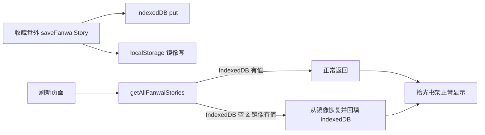

## 产品概述
本次聚焦两个问题：1) 拾光收藏的番外"收藏后刷新即消失"（不转发也丢）；2) 随机生成的番外太像"记忆总结"，缺乏虚构发挥。

## 核心特性
- **番外收藏持久化修复**：确保收藏的番外刷新后依然保留，彻底解决"保存不下来"的问题。
- **随机番外去"记忆总结味"**：随机模式下，番外以记忆/对话为灵感触发点，展开虚构想象，写出"没发生过"的故事，而非复述记忆。

## 功能与视觉
- 番外收藏行为不变（界面无改动），仅修复底层持久化可靠性。
- 随机生成番外的内容质量提升：更富想象、更像真正的短篇小说，而非记忆清单。


## 技术栈
- 现有项目（React + TypeScript + Vite），复用当前架构与工具。
- IndexedDB（utils/db.ts）为番外收藏主存储。
- localStorage 增加镜像兜底，保证刷新后数据可恢复。
- 副 API 非流式生成番外（不涉及）。

## 实现思路

### 1) 番外收藏持久化修复：localStorage 镜像双重保险
在 `utils/db.ts` 给番外收藏加 localStorage 镜像（遵循项目 `os_` 前缀 key 惯例，如 `os_fanwai_stories_v1`），让刷新后数据必然可恢复：

- **新增内部 helper `persistFanwaiMirror(list)`**：把整份番外列表 JSON 写入 localStorage（try/catch 忽略写失败，隐私模式不阻断主路径）。
- **`saveFanwaiStory`**：先读回当前列表（IndexedDB），append 新 story，同时 `put` 到 IndexedDB 和写 localStorage 镜像。注意避免递归——读回列表时走 `getAllFanwaiStories` 但内部不要触发 localStorage 回写逻辑，或直接用一个不递归的内部读取。
- **`deleteFanwaiStory`**：IndexedDB 删除的同时，从 localStorage 镜像列表移除并回写。
- **`getAllFanwaiStories`**：读取时优先 IndexedDB；**若 IndexedDB 为空而 localStorage 有值，则用 localStorage 内容覆盖回填 IndexedDB 并返回**，保证刷新后能从镜像找回。

关键决策：
- 镜像逻辑收敛在 DB 层（`utils/db.ts`），不依赖 OSContext 传完整列表，DB 层自洽，改动面最小。
- 番外收藏量级小，全文镜像进 localStorage（~5MB 上限内可接受）；若担心超限，镜像失败用 try/catch 忽略，不影响 IndexedDB 主路径。
- `saveFanwaiStory` 内部读回列表时，避免走 `getAllFanwaiStories` 的"空则回填"分支造成递归，用一个纯读函数。

### 2) 随机番外去"记忆总结味"
在 `utils/fanwaiGenerator.ts` 的 `buildFanwaiPrompt` randomMode 分支调整引导：

- 明确**番外是虚构创作**：角色人设、记忆、最近对话只是**灵感触发点**（一个画面、一句心事、一个未说出口的念头），不是要复述的内容。
- 强调"从一个记忆点展开想象，写出**没发生过**的故事：延伸、变奏、把某个瞬间放大成一整段人生/一场奇遇"。
- 移除/弱化常规模式的"不要与最近聊天走向脱节"这一约束（它属于常规模式，随机模式应允许自由发挥）。
- 保留角色内核人设不崩，但明确"记忆是素材不是主题"。

## 实现要点
- 镜像读写均 try/catch，避免 localStorage 异常阻断功能。
- `getAllFanwaiStories` 的"空则回填"只在 IndexedDB 空且 localStorage 有值时触发一次，正常场景零开销。
- 不改 UI 结构，不动 OSContext 软删除逻辑（根因是持久化可靠性，非删除竞态）。

## 架构设计
改动集中、低侵入，两个文件：



## 目录结构
```
project-root/
├── utils/
│   ├── db.ts                     # [MODIFY] saveFanwaiStory / deleteFanwaiStory / getAllFanwaiStories 增加 localStorage 镜像兜底
│   └── fanwaiGenerator.ts        # [MODIFY] buildFanwaiPrompt randomMode 分支：去除"记忆总结味"，强化虚构发挥
```


## Agent Extensions
### SubAgent
- **code-explorer**
  - 用途：在实现前核对 `utils/db.ts` 中 saveFanwaiStory/deleteFanwaiStory/getAllFanwaiStories 的精确行号与现有写入/读取结构，以及 `utils/fanwaiGenerator.ts` randomMode 分支的精确文案位置，确保镜像 helper 不引入递归、不改动其它调用点。
  - 预期结果：确认全部改动点，保证 localStorage 镜像读写与 IndexedDB 主路径兼容、随机模式 prompt 修改精准。
