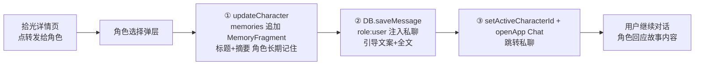

## 产品概述
为私聊新增「番外」功能：私聊 + 面板的「番外」占位按钮（🍉）点击后打开**全屏新页面**（非悬浮窗），配置文风、字数、第几人称、世界设定后，用**副 API**（主 API 仅用于聊天）读取当前角色设定与用户设定记忆，生成小说风格的番外内容；生成后可收藏到主界面新 App「拾光」，并可从「拾光」**转发给角色**——只有转发了，角色才真正"知道"这个故事（写入角色记忆流 + 注入私聊对话，之后对话可引用）；不转发则角色完全不知情。独立于「笔友会」。

## 核心功能
- **私聊「番外」入口**：现有占位按钮绑定动作，点击打开全屏番外生成页（返回可退出）
- **生成设置页**：文风（预设 chip：温柔治愈/古风/悬疑/日常甜宠/自定义）、字数档位（500/1000/2000/5000）、第几人称（第一/第二/第三人称）、世界设定（textarea 粘贴）；设置项 localStorage 记住上次选择
- **番外生成**：副 API（subBaseUrl/subApiKey/subModel）非流式生成；prompt 融合文风/字数/人称/世界设定 + 当前角色人设（persona/systemPrompt/worldview/memories）+ 用户设定（userProfile.name/bio）；副 API 未配置时 toast 提示去设置配置，不回落主 API
- **生成预览与收藏**：生成后书籍排版预览，一键收藏到「拾光」
- **「拾光」App**：主界面新应用，书架式网格展示收藏（角色名/文风/时间/摘要），点击进全文阅读页；支持删除；空状态引导
- **转发给角色（角色真正知情）**：拾光详情页选角色 → ①写入该角色长期记忆（MemoryFragment，标题+摘要，角色从此"记住"）→ ②以 user 消息注入该角色私聊对话（引导文案+全文，角色当前上下文立即读到）→ ③跳转该角色私聊，用户继续对话即可触发角色回应；原文保留在拾光


## 技术选型
- 沿用项目现有技术栈：React + TypeScript + Tailwind CSS（项目自建组件体系，不引入新 UI 库）
- 数据持久化：IndexedDB（`utils/db.ts` 新增 store，DB_VERSION 71→72）+ OSContext 全局状态，与 novels 存储模式一致

## 实施思路
### 生成链路（参照 `utils/theaterGenerator.ts` 非流式 OpenAI 兼容调用）
`POST {subBaseUrl}/chat/completions`，headers `Authorization: Bearer {subApiKey}`，body `{ model: subModel, messages: [system+user], stream: false }`；prompt 拼接文风/字数/人称/世界设定 + 角色人设 + 用户设定；副 API 未配置（`!apiConfig.subBaseUrl`）→ toast「请先在设置 → 副 API 配置」直接返回，不回落主 API（保持主 API 仅聊天）。

### 入口与页面
- `components/chat/ChatInputArea.tsx` 番外按钮：`onClick={() => onPanelAction('fanwai')}`，去掉 `aria-disabled`
- `apps/Chat.tsx` onPanelAction switch 新增 `case 'fanwai'`：`setShowPanel('none'); setFanwaiOpen(true);`
- `components/fanwai/FanwaiGeneratePage.tsx`：`fixed inset-0 z-50` 全屏覆盖（顶部返回箭头，视觉独立页面，区别于 ImageGenPanel 的居中悬浮卡片），含表单/加载态/预览/收藏

### 「拾光」App 注册链路
- `types.ts` AppID 枚举新增 `Fanwai = 'fanwai'`
- `constants.tsx` INSTALLED_APPS 新增 `{ id: AppID.Fanwai, name: '拾光', icon: 'Fanwai', color: 'amber' }` + 图标映射（新增 Book/Sparkle 风格 icon 组件）
- `components/PhoneShell.tsx` APP_BY_ID 懒加载表（114-128 行）+ renderApp switch（849 行起）注册 FanwaiApp

### 转发给角色（核心：让角色真正知情）
参照既有模式（`GameApp.tsx` 920-925/1061-1069 行的 `updateCharacter(memories)` + `DB.saveMessage` 注入、`NovelWriter.tsx` 415-421 行的记忆写入、types.ts 999 行 memoryText 注释"让角色真的知道发生了什么"）：



1. **写入角色长期记忆**：`updateCharacter(roleId, { memories: [...(role.memories||[]), { id: 'mem-fanwai-${Date.now()}', date: 当天, summary: 标题 + 内容开头摘要（截断 ~100 字）, mood: 'creative' }] })` → 角色从此记住这个故事，后续对话/记忆归档可引用
2. **注入私聊上下文**：`DB.saveMessage({ charId: roleId, role: 'user', type: 'text', content: '我读到一篇关于我们的故事，想给你看：\n\n' + 全文 })`（user 角色 = 用户分享给它，不打断角色主动行为）
3. **跳转私聊**：`setActiveCharacterId(roleId)` + `openApp(AppID.Chat)` + toast「已转发给 {角色名}，ta 已经读到这个故事」
4. **原文保留**：拾光内容不删除，转发仅复制

## 实施注意
- 副 API 字段已在 `types.ts`（subBaseUrl/subApiKey/subModel，272-275 行）与 Settings 中存在，**直接复用，勿新增配置项**
- 新 store `'fanwai_stories'`（keyPath: id）：`utils/db.ts` 加 `STORE_FANWAI_STORIES` 常量 + `createStore` + `DB_VERSION = 72`；`apps/Chat.tsx` / `OSContext` 提供 getAllFanwaiStories/saveFanwaiStory/deleteFanwaiStory
- OSContext 备份导出 store 清单（3716-3719 行区域）加入 `fanwai_stories`，保证备份携带收藏
- 生成页设置用 localStorage 记忆（键 `os_fanwai_form_*`）
- 长文本：列表卡片只显示摘要（截断），详情页 `white-space: pre-wrap` 全文渲染；生成请求非流式单次调用，长文提示耗时
- 记忆写入用 updateCharacter 既有机制（自动落库+打脏），勿绕过；MemoryFragment 结构与既有一致（含 mood 字段兼容）

## 目录结构
```
project-root/
├── types.ts                        # [MODIFY] AppID 新增 Fanwai='fanwai'；新增 FanwaiStory 接口（id/charId/charName/style/wordCount/pov/worldSetting/content/createdAt）
├── constants.tsx                   # [MODIFY] INSTALLED_APPS 新增「拾光」+ 图标映射
├── utils/
│   └── fanwaiGenerator.ts          # [NEW] 副 API 非流式生成 + prompt 拼装 + 收藏数据读写 helper
├── utils/db.ts                     # [MODIFY] DB_VERSION=72 + STORE_FANWAI_STORIES + createStore + CRUD
├── context/OSContext.tsx           # [MODIFY] fanwaiStories 状态 + addFanwaiStory/deleteFanwaiStory + 备份导出清单
├── components/chat/ChatInputArea.tsx   # [MODIFY] 番外按钮 onClick 绑定 onPanelAction('fanwai')，去掉 aria-disabled
├── components/fanwai/
│   └── FanwaiGeneratePage.tsx      # [NEW] 全屏生成页：表单 + 加载态 + 全文预览 + 收藏按钮
├── apps/Chat.tsx                   # [MODIFY] case 'fanwai' + 渲染 FanwaiGeneratePage（传副 API 配置、当前角色、userProfile、收藏回调）
├── apps/FanwaiApp.tsx              # [NEW] 拾光 App：书架列表 + 详情阅读 + 转发弹层（含记忆写入+消息注入+跳转）+ 删除
└── components/PhoneShell.tsx       # [MODIFY] APP_BY_ID + renderApp switch 注册 FanwaiApp
```

## 关键代码结构
### FanwaiStory 数据模型
```ts
export interface FanwaiStory {
  id: string;          // `fanwai-${Date.now()}-${rand}`
  charId: string;      // 生成时的当前角色 id
  charName: string;    // 角色名（列表/转发展示）
  style: string;       // 文风
  wordCount: number;   // 字数档位
  pov: 'first' | 'second' | 'third';  // 人称
  worldSetting: string; // 用户粘贴的世界设定
  content: string;     // 生成的全文
  createdAt: number;   // 时间戳
}
```
### 转发核心签名
```ts
// FanwaiApp 内（或 utils/fanwaiGenerator.ts helper）
async function forwardStoryToChar(
  story: FanwaiStory,
  role: CharacterProfile,
  deps: { updateCharacter: (id: string, p: Partial<CharacterProfile>) => void; DB: typeof import('../utils/db').DB }
): Promise<void>;
// 内部：写 MemoryFragment（title+摘要）→ DB.saveMessage(role:'user') → 跳转由调用方完成
```


## 设计风格
延续 SullyOS 手机壳的现代暖色 OS 风格：圆角卡片、柔和渐变、毛玻璃、微动效，营造温柔治愈的手帐氛围。

### 番外生成页（私聊内全屏）
- 顶部导航栏：返回箭头 + 标题「番外」+ 暖金主题点缀；整页 `fixed inset-0` 覆盖屏幕，白/米色毛玻璃底，视觉上是独立新页面
- 设置表单区：文风用横向滑动预设 chip（温柔治愈/古风/悬疑/日常甜宠/自定义），选中暖金高亮；字数档位（500/1000/2000/5000 字）分段按钮；人称三选一胶囊；世界设定大圆角 textarea（浅米色底、焦点暖金描边）
- 生成按钮：底部通栏渐变按钮（琥珀→玫瑰），加载态旋转光晕 +「正在为 ta 编织故事…」
- 预览区：书籍排版（衬线标题、正文 1.6 行高、首行缩进、pre-wrap），底部「收藏到拾光」渐变按钮；收藏成功 toast + 跳转提示

### 拾光 App
- 书架式网格：每张卡片为迷你书封面（每篇按文风取渐变底色 + 书名/角色名/文风标签），点击进详情；淡入上滑入场动效
- 详情页：书卷式大标题 + 元信息行（角色 · 文风 · 字数 · 日期）+ 纸张质感背景全文阅读 + 底部操作栏（转发给角色 / 删除）
- 转发弹层：角色列表（头像+名字+简介），确认后 toast「已转发，ta 已经读到这个故事」并跳转私聊
- 空状态：暖色插画风提示「还没有收藏的番外，去私聊生成一篇吧」+ 引导按钮

### 视觉基调
暖金琥珀为主色，米白/暖灰为底，玫瑰/莓果点缀；动效以淡入、上滑、卡片按压缩放为主，轻量不打扰。

## Agent Extensions
### Skill
- **frontend-design**
  - Purpose: 为番外生成页与拾光 App 提供视觉设计指导，确保暖色治愈风格不落俗套、符合 SullyOS 既有审美
  - Expected outcome: 产出差异化视觉方案（配色、排版、组件细节），在任务 3 与任务 4 中落地
### SubAgent
- **code-explorer**
  - Purpose: 实施前确认 Chat.tsx 渲染区插入点、OSContext 备份清单格式、PhoneShell renderApp 具体分支等细节
  - Expected outcome: 精确定位各文件修改点，避免计划落地时的遗漏与返工
