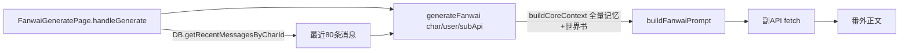

## 用户需求

调整番外生成功能，解决"AI 味太重"问题，具体包括：

1. **去 AI 味**：怀疑是内置 prompt 措辞问题。重写生成提示词，借鉴著名作家的文风，避免千篇一律的模板感。
2. **多作家风格**：将著名作家风格融入现有 5 个文风预设（温柔治愈、古风、悬疑、日常甜宠、自定义）的名称与提示文案中。
3. **读取聊天上下文**：生成番外时读取当前私聊最近 50~100 条消息作为"灵感来源"，让故事顺着近期对话展开。
4. **完全读取角色记忆**：生成时全量读取角色卡记忆（月度总结、当月日志、世界书、印象档案）。
5. **不避讳 NSFW**：涉及亲密/成人情节时明确直白地描写，不打马赛克、不借代，尺度由剧情与人物关系自然决定。

## 产品概述

番外生成是私聊「番外」入口 → 全屏配置页 → 用副 API 生成小说式短篇，可收藏进「拾光」书架。本次只调整 prompt 拼装逻辑与预设文案，不新增 UI 选择控件，不改生成流程。

## 核心特性

- 文风预设文案增强，锚定作家风格（村上春树/汪曾祺、唐传奇/张爱玲、东野圭吾、亦舒等）
- 生成 prompt 注入最近聊天上下文作为灵感源
- 全量读取角色记忆与世界书
- NSFW 情节明确直白不避讳
- 去除"列举禁语"类机械提示，改正向文学引导


## 技术栈
- 现有项目（React + TypeScript + Vite），复用当前架构与工具
- 副 API（subBaseUrl/subApiKey/subModel）非流式生成番外，主 API 不参与
- IndexedDB 读取聊天记录（DB.getRecentMessagesByCharId）
- 角色上下文复用 ContextBuilder.buildCoreContext 全量输出

## 实现思路

### 核心策略
在 `utils/fanwaiGenerator.ts` 内完成绝大部分改造：重写文风预设文案、重写 `buildFanwaiPrompt`（注入聊天上下文 + 作家参照 + NSFW 引导 + 去 AI 味的正向铁律）、扩展 `generateFanwai` 签名接收最近消息。入口页 `FanwaiGeneratePage.tsx` 的 `handleGenerate` 里用现成的 `DB.getRecentMessagesByCharId(char.id, N)` 拉取最近消息传入。UI 文风按钮直接渲染预设的 name/hint，改预设文案即自动联动，无需改动选择逻辑。

### 关键决策
- **文风作家映射**（融进预设 name/hint，prompt 写"参照该作家节奏与意象，非抄袭"）：
  - healing 温柔治愈 → 村上春树（疏离留白）/ 汪曾祺（清淡烟火）
  - ancient 古风 → 唐传奇 / 张爱玲（含蓄雅致）
  - suspense 悬疑 → 东野圭吾（克制冷峻）
  - daily 日常甜宠 → 亦舒 / 小甜文节奏
  - custom 自定义 → 保留，提示文案可加"可填参照作品"
- **记忆全量**：`buildCoreContext(char, user, true)` 全量输出角色卡记忆；记忆宫殿不强开，仅当 `memoryPalaceEnabled` 本就开启时由 buildCoreContext 自然带出（安全优先）。
- **聊天上下文**：拉最近 80 条（落在 50~100 区间），格式化为"你们最近的对话"，截断单条长度与总量控制 token。
- **去 AI 味**：删除"列举禁语"类条款（尤其"不要出现'番外''本篇完'"，会反而激活它），改成正向引导（用具体动作/物件/环境推进、少用抽象安慰、避免三连排比与机械连接词、结尾不强行升华）。
- **NSFW**：新增引导"涉及亲密/成人情节时明确直白地写，不借代、不打码，尺度由剧情与两人关系自然决定"。

### 实现要点
- `generateFanwai` 新增可选参数 `recentMessages?: { role: string; content: string }[]`，向后兼容（缺省时跳过上下文块）。
- 聊天上下文拼接需转义/清洗（去除卡片类 message 的结构化内容，仅取纯文本），避免注入脏数据。
- 控制 token：最近消息总量设上限（如 4000 字符），超出截断最旧部分；max_tokens 计算已按字数留足余量，不受影响。
- 不改 `FanwaiGeneratePage.tsx` 的 UI 结构与选择逻辑，仅在其 `handleGenerate` 中调用 `generateFanwai` 前拉取最近消息。

## 架构设计

改动集中、低侵入，仅涉及两个文件，无新增架构模式：



## 目录结构

```
project-root/
├── utils/
│   └── fanwaiGenerator.ts      # [MODIFY] 重写文风预设文案(name/hint)、重写 buildFanwaiPrompt
│                               #         注入聊天上下文+作家参照+NSFW引导+正向铁律；
│                               #         扩展 generateFanwai 签名接收 recentMessages 并拼进 prompt
└── components/
    └── fanwai/
        └── FanwaiGeneratePage.tsx  # [MODIFY] 仅 handleGenerate 中，调用 generateFanwai 前用
                                    #          DB.getRecentMessagesByCharId(char.id, 80) 拉最近消息，
                                    #          清洗后作为 recentMessages 传入；引入 DB import
```


## Agent Extensions
### SubAgent
- **code-explorer**
  - 用途：在制定番外生成改造方案时，辅助核对聊天消息清洗规则、Message 结构字段（role/type/content/metadata）与 IndexedDB 读取边界，确保 prompt 注入上下文时不会带入结构化卡片脏数据。
  - 预期结果：确认 `DB.getRecentMessagesByCharId` 返回的 Message 各字段含义，以及需要过滤/清洗的消息类型（如 fanwai_card、music 卡片等），保证注入的聊天上下文干净、可读。
