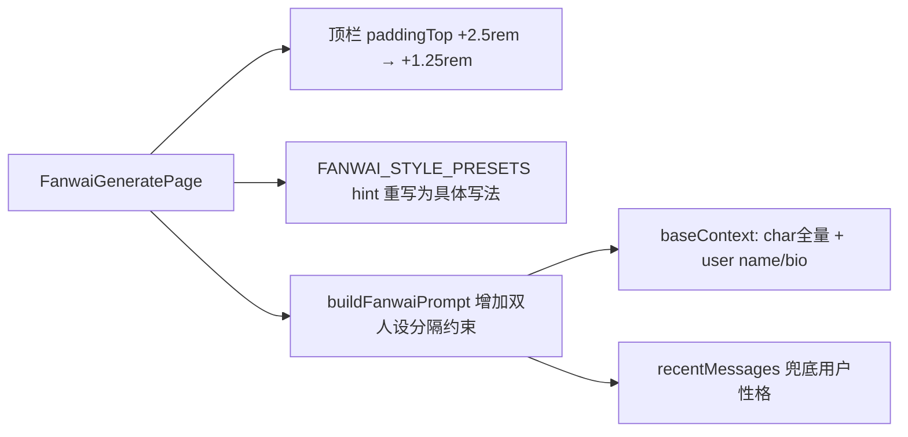

## 产品概述
本次针对「番外生成」功能做三处优化：压缩顶栏顶部留白、文风预设去 AI 味、番外生成时明确区分并同时读取「角色人设」与「用户人设」。

## 核心特性
1. **顶栏留白压缩**：手机上番外页顶栏内容沉底、上方留出大块空白。通过减小顶栏 padding 让返回键与标题上移，压缩顶部留白，视觉上顶栏更紧凑靠上。
2. **文风预设去 AI 味**：重写温柔治愈/古风/悬疑/日常甜宠 4 个预设的描述，从「作家名 + 抽象形容」改为「具体写法指引」（句式长短、意象偏好、叙事节奏、对话密度、留白程度、忌用什么），作家名降级为辅助参考小字，避免生成模板化的小红书风。
3. **角色/用户人设双读**：番外 prompt 中明确区分「角色（TA）的人设」与「用户（我）的人设」，两边都完整读取。用户不再是背景板，而是有独立人设的叙事主体；角色与用户的性格、说话方式、关系归属绝不能混淆。当用户 bio 为空时，引导 AI 从最近聊天中提炼用户性格来塑造「我」。

## 功能与视觉
- 不改 UI 布局结构，仅调整顶栏 padding 数值与文风文案、prompt 引导语。
- 视觉上：顶栏标题上移、顶部留白减小；文风卡片下方辅助小字（作家参考）弱化、主描述更具体。


## 技术栈
复用现有项目（React + TypeScript + Vite），无新增依赖。改动集中在两个文件。

## 实现思路

### 1) 顶栏留白压缩
`components/fanwai/FanwaiGeneratePage.tsx` 生成页（第 174 行）与预览页（第 387 行）顶栏都用 `paddingTop: 'calc(var(--chrome-top) + 2.5rem)'`。`--chrome-top` 已含安全区 + 状态栏（index.html:132 = `calc(var(--safe-top) + 1.5rem)`），再加 2.5rem 明显过量，导致内容沉底。

将两处 `+ 2.5rem` 统一改为 `+ 1.25rem`（留约一个字符的视觉呼吸，避免顶到安全区边界）。同时把 `pt-2 pb-2` 调整为 `pt-1 pb-2`，进一步压缩垂直冗余。

### 2) 文风预设重写
`utils/fanwaiGenerator.ts` 第 28-34 行 `FANWAI_STYLE_PRESETS`：
- 保留 `id` / `name` / `author`（author 作为 UI 辅助小字段，不影响 prompt 主导）。
- 重写 4 个预设的 `hint` 为**具体写法描述**，统一遵循「教写法而非贴标签」原则，例如：
  - healing（温柔治愈）：短句为主、单句不超过一行，不解释情绪、用动作与细节暗示；忌"我感到""我意识到"式心理直述；结尾留一个未说出口的念想。
  - ancient（古风）：词句凝练、意象清丽（灯火、长街、书信、月色），善用留白与含蓄；忌现代网络用语与长篇铺陈。
  - suspense（悬疑）：冷峻克制的陈述句，伏笔逐层揭露，节奏收紧，信息不一次给全；忌平铺直叙。
  - daily（日常甜宠）：轻松明快、对话密度高，以互动细节与心动瞬间推进；忌煽情与过度内心独白。
- `hint` 保留在 prompt 注入（buildFanwaiPrompt 的 styleHint），让 AI 按具体写法写，而非背作家名。

### 3) 角色/用户人设双读
`utils/fanwaiGenerator.ts` 的 `buildFanwaiPrompt`：
- 现状：`baseContext = ContextBuilder.buildCoreContext(char, user, true)` 已同时注入 char 全量人设 + user 的 name/bio（context.ts:186-188），但 user 只一行，AI 易把用户当背景板。
- 改造：在 prompt 的「写作准则」区强化一段「双人设分隔说明」：
  - 明确「角色 = ${char.name}，是故事的 TA；用户 = ${uname}，是故事的「我」」。两边是**两个独立的、有血有肉的人**，各自的性格、说话方式、习惯、来历必须分别贴合其人设，绝不能混淆或相互覆盖。
  - 用户的性格/外观/习惯等以 `user.bio` 为准；若 bio 为空，则从下方最近聊天记录中提炼用户（「我」）的言行、语气、性格特征来塑造，而不是让「我」变成没有特征的背景板。
  - 角色与用户之间的称呼、关系、相处模式要正确，符合双方设定。
- 该说明同时适用于常规模式与随机模式（randomMode 分支也注入同样的身份/人设分隔约束）。

## 实现要点
- 两处顶栏 `+ 2.5rem` 必须同步改，避免生成页与预览页高度不一致。
- 文风 hint 重写只改文案，不改字段结构、不改 `id`/`author` 消费逻辑，FanwaiStory.style 存 id 不受影响。
- 双人设说明为纯 prompt 文案增强，不改 `buildCoreContext`、不动 `ContextBuilder` 与其它调用点，改动面最小、零回归风险。
- `user.bio` 空值兜底依赖已有的 `recentMessages`（fanwaiGenerator.ts:96-103），无需额外数据源。

## 架构设计
改动集中、低侵入，均为文案/数值级调整，不改数据流与组件结构：



## 目录结构
```
project-root/
├── components/
│   └── fanwai/
│       └── FanwaiGeneratePage.tsx   # [MODIFY] 生成页+预览页顶栏 padding 由 2.5rem 压缩至 1.25rem
└── utils/
    └── fanwaiGenerator.ts           # [MODIFY] 重写4个文风预设 hint + buildFanwaiPrompt 增加双人设分隔约束
```

## 关键代码结构
双人设分隔约束（加入 buildFanwaiPrompt 常规/随机两分支的「写作准则」），供参考：
```
### 双人设分隔（务必遵守）
- 角色「${char.name}」与用户「${uname}」是两个独立、有血有肉的人。
- 角色的人设（性格/说话方式/习惯/来历）贴合上面的角色设定；用户「${uname}」的人设（性格/语气/习惯）贴合 user.bio，若 bio 为空，则从最近聊天记录中提炼「${uname}」的言行与性格来塑造，绝不能把「${uname}」写成没有特征的背景板。
- 两人各自的性格、说话方式、称呼与相处模式必须分别正确，绝不能把角色的视角/性格安到用户头上，反之亦然。
```


## Agent Extensions
### SubAgent
- **code-explorer**
  - 用途：实现前核对 `components/fanwai/FanwaiGeneratePage.tsx` 顶栏两处 padding 的精确位置，以及 `utils/fanwaiGenerator.ts` 中 `FANWAI_STYLE_PRESETS` 与 `buildFanwaiPrompt` 常规/随机两分支的精确行号，确保改动不误伤其它调用点、不引入回归。
  - 预期结果：确认全部改动点准确，文风 hint 重写不破坏字段结构与消费逻辑，双人设约束注入位置正确。
